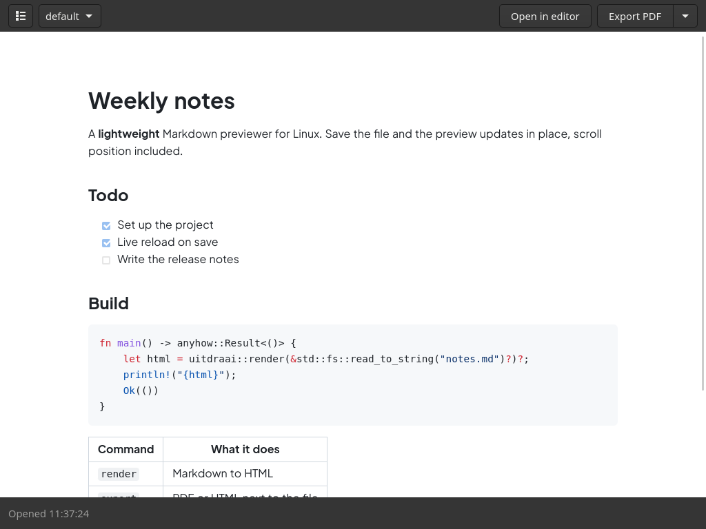

# uitdraai

Lightweight Markdown previewer for Linux, Wayland-first (niri, Hyprland). Live preview in a small GTK4/WebKit window, PDF export through WeasyPrint. The CLI works without the GUI.



> **Vibe coded.** Built together with an AI coding assistant (Claude Code), with a human reviewing and testing every step. Read the code before trusting it with anything important.

## Features

- Live reload on save that keeps your scroll position
- PDF export with print CSS (A4, page numbers, sensible page breaks) and standalone HTML export
- Themes: a built-in `default`, your own in `~/.config/uitdraai/themes/`
- Code highlighting, tables, task lists and footnotes (GitHub Flavored Markdown)
- Safe by default: no JavaScript in the page, raw HTML and remote images off unless you pass `--allow-html` or `--allow-remote`

## Install

You need Rust (edition 2024), GTK 4.10+, WebKitGTK 6.0 and, for PDF export, WeasyPrint.

- **Arch:** `gtk4 webkitgtk-6.0 python-weasyprint`
- **Fedora:** `gtk4-devel webkitgtk6.0-devel weasyprint`
- **Debian/Ubuntu 24.04+:** `libgtk-4-dev libwebkitgtk-6.0-dev weasyprint`
- **NixOS:** `nix run github:kjvdven/uitdraai`, or `nix develop` for the libraries and WeasyPrint

```sh
cargo install --git https://github.com/kjvdven/uitdraai
# CLI only, without GTK/WebKit:
cargo install --git https://github.com/kjvdven/uitdraai --no-default-features
```

For your launcher and "Open with" on Markdown files, install the desktop entry and icons from a checkout. If `~/.cargo/bin` isn't on your session's `PATH`, put the full path in its `Exec=` line.

```sh
install -Dm644 data/io.github.kjvdven.uitdraai.desktop -t ~/.local/share/applications/
cp -r data/icons ~/.local/share/
```

## Usage

```sh
uitdraai notes.md                      # open the preview window
uitdraai render notes.md -o notes.html # HTML to a file (or stdout)
uitdraai export notes.md --pdf         # notes.pdf next to notes.md
uitdraai export notes.md --pdf --watch # re-export on every save
uitdraai themes                        # list themes
uitdraai themes --dump default > ~/.config/uitdraai/themes/mine.css
```

In the window, `Ctrl+?` lists all shortcuts. The app id is `io.github.kjvdven.uitdraai`, for window rules.

## Configuration

`~/.config/uitdraai/config.toml`, every key optional. `Ctrl+,` in the window creates and opens it.

```toml
theme = "mine"                   # default theme
export_dir = "/home/you/PDF"     # where exports go
default_export = "html"          # what Ctrl+E and the export button produce (default: "pdf")
editor = ["ghostty", "-e", "hx"] # "Open in editor"; default is your desktop's app for Markdown
disable_dmabuf = true            # if the window stays empty (common on NVIDIA)
```

## License

Licensed under either of [Apache License 2.0](LICENSE-APACHE) or [MIT](LICENSE-MIT), at your option.
