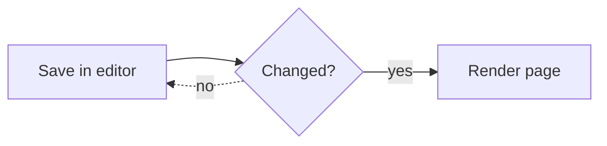
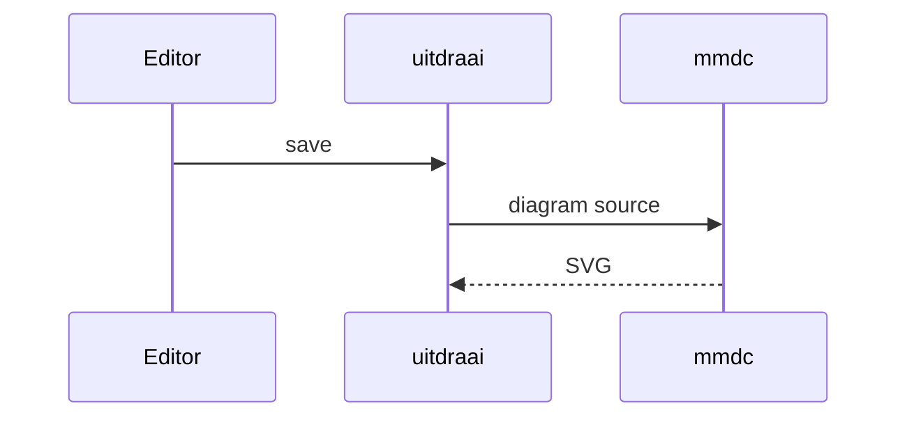

# Diagrams

```mermaid
flowchart LR
    Save[Save in editor] --> Watch{Changed?}
    Watch -- yes --> Render[Render page]
    Watch -. no .-> Save
```

```mermaid
sequenceDiagram
    Editor->>uitdraai: save
    uitdraai->>mmdc: diagram source
    mmdc-->>uitdraai: SVG
```

Broken on purpose:

```mermaid
flowchart LR
    A -->
```
